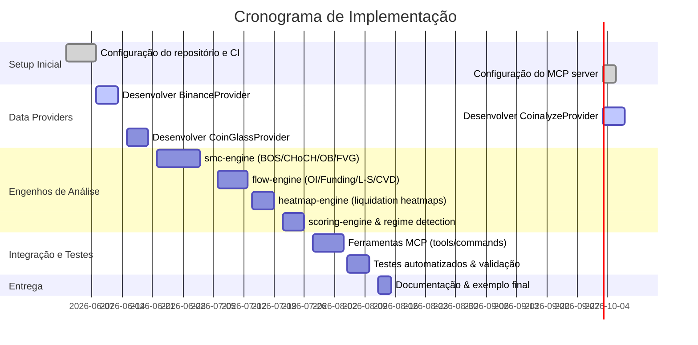
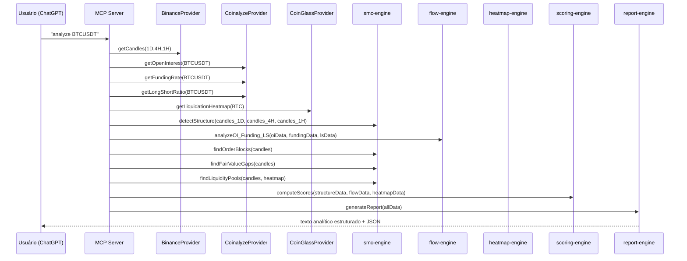

# Resumo Executivo

Este documento apresenta um **projeto completo** para um sistema de análise institucional de criptomoedas (criptos) baseado em Smart Money Concepts (SMC), utilizando dados em tempo real de **Coinalyze**, **CoinGlass** e **Binance Futures**. Serão definidas a arquitetura, as principais APIs e endpoints utilizados, algoritmos determinísticos para detectar padrões de mercado (BOS, CHoCH, Order Blocks, FVGs, liquidez, fluxos de derivativos, etc.), além de pontuações (scores) institucionais e engines de confluência. Também serão fornecidos exemplos de código (pseudocódigo TypeScript), diagramas (Mermaid) de arquitetura e sequência, esquemas JSON de respostas das ferramentas MCP, e casos de teste para BTC. O objetivo é criar uma solução **modular, extensível e pronta para produção**, obedecendo às melhores práticas de engenharia e às APIs oficiais.

---

## 1. Arquitetura do Sistema

O sistema terá arquitetura **modular** em Node.js/TypeScript, com vários pacotes (packages) e ferramentas MCP. A seguir está um diagrama simplificado da arquitetura proposta:

```mermaid
graph LR
  subgraph Coleta de Dados
    A[Binance Futures API] -->|candles, OI, funding| BP(BinanceProvider)
    B[Coinalyze API] -->|OI, funding, L/S| CP(CoinalyzeProvider)
    C[CoinGlass API] -->|heatmaps, liquidações, L/S| GP(CoinGlassProvider)
  end
  subgraph Análise
    BP --> SMC[smc-engine]
    BP --> Flow[flow-engine]
    CP --> Flow
    CP --> Heat[heatmap-engine]
    GP --> Heat
    SMC --> Score[scoring-engine]
    Flow --> Score
    Heat --> Score
    Score --> Report
    SMC --> Report
    Flow --> Report
    Heat --> Report
  end
  subgraph Apresentação
    Report(Report Engine) -->|texto analítico + JSON| U[Usuário (MCP)]
  end
  U --> MCP[MCP Server]
  MCP --> BP
  MCP --> CP
  MCP --> GP
  MCP --> SMC
  MCP --> Flow
  MCP --> Heat
  MCP --> Score
  MCP --> Report
```

No diagrama:

- **Data Providers (BinanceProvider, CoinalyzeProvider, CoinGlassProvider)**: módulos responsáveis por consultar APIs externas (Binance, Coinalyze, CoinGlass) e fornecer dados normalizados.
- **smc-engine**: detecta estrutura de mercado (BOS, CHoCH), Swing High/Low, Order Blocks, FVGs, liquidez interna (Highs/Lows iguais), etc.
- **flow-engine**: analisa fluxos de derivativos (Open Interest, Funding, Long/Short Ratio, CVD, liquidações).
- **heatmap-engine**: processa dados de liquidações (CoinGlass) para identificar zonas de concentração de liquidez.
- **scoring-engine**: calcula scores institucionais (bullish, bearish, confiança) com base em fatores diversos.
- **report-engine**: gera o texto final da análise seguindo o formato requerido (contextos 1D/4H/1H, cenários, zonas de entrada, etc) e também respostas JSON estruturadas.

Essa arquitetura separa **coleta de dados**, **análise** e **apresentação**, permitindo testes unitários em cada módulo e fácil manutenção. Cada pacote (e.g. `data-providers`, `smc-engine`, `flow-engine`, etc.) terá responsabilidades claras.

---

## 2. Fontes de Dados e Endpoints

O sistema integrará várias fontes de dados oficiais:

- **Coinalyze API (REST v1)** – fornece dados agregados de futuros (Open Interest, Funding, Long/Short Ratio, liquidações, etc.) em formato JSON.  
  - Endpoints principais: 
    - `/open-interest` – OI atual (parâmetro `symbols`).
    - `/funding-rate` – Funding atual (parâmetro `symbols`).
    - `/long-short-ratio-history` – Histórico L/S (parâmetro `symbols`, `interval`, `from`, `to`).
    - `/ohlcv-history` – Candles históricos (parâmetros `symbol`, `interval`, `from`, `to`).
    - `/liquidation-history` – Histórico de liquidações por par.
  - *Exemplo de resposta* (`/open-interest`):  
    ```json
    [
      {"symbol": "BTCUSDT_PERP", "value": 1200000000, "update": 1686300000}
    ]
    ```
- **CoinGlass API (Open API v4)** – oferece dados institucionais avançados (heatmaps de liquidação, liquidações agregadas, OI/LS por exchange, etc.).  
  - Endpoints principais:
    - `/api/futures/openInterest/ohlc-history` – OI OHLC por período (exemplo no guia).
    - `/api/futures/liquidation/history` – liquidações históricas por par.
    - `/api/futures/liquidation/aggregated-history` – liquidações agregadas por mercado.
    - `/api/futures/liquidation/heatmap/model2` – heatmap de liquidações (modelo 2).
    - `/api/futures/global-long-short-account-ratio/history` – L/S global histórico.
    - `/public/v2/liqHeatmap` – heatmap público de liquidações (exemplo no Readme v2).  
  - Os resultados são arrays JSON com detalhes (geralmente intesidade de liquidação por faixa de preço).
- **Binance Futures API (USDⓈ-M)** – dados em tempo real de mercado (candles, OI, funding):
  - `GET /fapi/v1/klines` – retira candles OHLCV de um símbolo (ex.: `symbol=BTCUSDT`, `interval=1d/4h/1h`).  
  - `GET /fapi/v1/openInterest` – OI atual para um símbolo (ex.: `symbol=BTCUSDT`).  
  - `GET /fapi/v1/fundingRate` – histórico de funding (parâmetros `symbol`, `startTime`, `limit`).
  - `GET /fapi/v1/longShortRatio` – dados L/S por símbolo (utilizar `limit`, `startTime`, `period` para histórico).
  - *Exemplo de resposta* (`/fapi/v1/klines`):  
    ```json
    [
      [1696243200000, "36000.00", "37000.00", "35500.00", "36500.00", "1200.5", 1696329599999, "4.394e7", 1000, "600.2", "2.197e7", "0"]
    ]
    ```  
  - *Exemplo de OI* (`/fapi/v1/openInterest`):  
    ```json
    {"symbol":"BTCUSDT","openInterest":"10659.509","time":1696329600000}
    ```
 
**Observação:** Caso algum endpoint específico não seja disponibilizado por essas APIs, planejar estratégias alternativas (e.g. leitura de webhooks do TradingView, scraping leve ou fallback a outras APIs públicas). Por exemplo, se o Coinalyze não fornecer diretamente Long/Short Ratio atual, podemos usar o Binance `/fapi/v1/longShortRatio` ou dados do CoinGlass (se disponíveis). Nos casos em que um detalhe de API não for encontrado na documentação oficial, indicaremos explícitamente como “**não especificado**” e sugeriremos a melhor solução disponível.

---

## 3. Adaptadores de Dados (Data Layer)

Cada fonte de dados terá um **adaptador dedicado** (ex.: `BinanceProvider`, `CoinalyzeProvider`, `CoinGlassProvider`). Esses adaptadores devem:

- **Fazer requisições HTTP** às APIs mencionadas, usando bibliotecas como Axios ou fetch, com suporte a **async/await**.
- **Gerenciar autenticação** e cabeçalhos (p.ex. `api_key` para Coinalyze e CoinGlass).
- **Implementar retry/backoff** em caso de erros de rede ou limites de taxa. Conforme a Coinalyze, o limite é 40 calls/min; a API responde 429 com `Retry-After`.
- **Cache interno**: armazenar temporariamente (memória ou leve DB) os últimos resultados para evitar chamadas redundantes dentro de um mesmo ciclo de análise.
- **Normalizar dados**: converter os dados recebidos (JSON bruto) em estruturas internas consistentes (arrays de candles, objetos OI/funding com timestamp, etc).

**Exemplo (pseudocódigo TypeScript) de adaptador Binance para candles:**  
```typescript
async function fetchBinanceCandles(symbol: string, interval: string, startTime?: number, endTime?: number): Promise<Candle[]> {
  const params: any = { symbol, interval };
  if (startTime) params.startTime = startTime;
  if (endTime) params.endTime = endTime;
  const url = `https://fapi.binance.com/fapi/v1/klines`;
  const response = await axios.get(url, { params });
  // Converter array de arrays em objetos Candle
  return response.data.map((c: any[]) => ({
    t: c[0], open: parseFloat(c[1]), high: parseFloat(c[2]),
    low: parseFloat(c[3]), close: parseFloat(c[4]), volume: parseFloat(c[5])
  }));
}
```
Esse método chamaria o endpoint `/fapi/v1/klines` conforme a documentação. De modo similar, um adaptador Coinalyze executaria requisições ao `/open-interest`, `/funding-rate`, etc., retornando objetos tipados (e.g. `{ symbol, value, update }`). O adaptador CoinGlass faria requisições como `/api/futures/openInterest/ohlc-history` (ex.: `https://open-api-v4.coinglass.com/api/futures/openInterest/ohlc-history?symbol=BTC&interval=1d&limit=30`) e `/public/v2/liqHeatmap?exchange=Binance&symbol=BTCUSDT&type=3d`.

Todas as chamadas devem respeitar limites de taxa e tratar erros (timeout, 429, etc.). Idealmente, usar MCP tools de retentativa automática ou implementar lógica com `axios-retry`. O design do data layer assegura que cada análise seja baseada em dados frescos, mas sem sobrecarregar as APIs.

---

## 4. Motores Analíticos

### 4.1 smc-engine (Estrutura de Mercado)

O **smc-engine** recebe candles (OHLC) e identifica padrões de Price Action:

- **Swing High / Swing Low**: Detectar topos e fundos significativos. Uma abordagem comum (uso de fractais) considera uma vela como swing high se seu preço alto for maior que os 2 vizinhos anteriores e posteriores. Pseudocódigo:
  ```typescript
  function findSwingHighs(candles: Candle[], range: number = 2): number[] {
    const swings: number[] = [];
    for (let i = range; i < candles.length - range; i++) {
      let isHigh = true;
      for (let j = 1; j <= range; j++) {
        if (candles[i].high <= candles[i-j].high || candles[i].high <= candles[i+j].high) {
          isHigh = false; break;
        }
      }
      if (isHigh) swings.push(candles[i].high);
    }
    return swings;
  }
  ```
- **Break of Structure (BOS)**: Rompimento de topos/fundos anteriores. Por exemplo, em tendência de baixa, um BOS bearish ocorre quando o preço faz novo fundo abaixo do anterior. Pode-se comparar a sequência de swings:
  ```typescript
  function detectBOS(candles: Candle[]): { direction: string, level: number }[] {
    const highs = findSwingHighs(candles);
    const lows = findSwingLows(candles);
    // Se último low < low anterior => BOS Bearish
    // Se último high > high anterior => BOS Bullish
    // Retornar lista de eventos com tipo e nível (preço).
  }
  ```
- **Change of Character (CHoCH)**: Primeira mudança na estrutura. Por exemplo, se a tendência era bullish e começa a formar BOS bearish, marca-se CHoCH. Implementar como: após um BOS contrário, o próximo rompimento no outro sentido será CHoCH.
- **Order Blocks (OB)**: Zonas institucionais (última vela não diluída antes do impulso). Detectamos OBs como regiões de congestão antes de movimento forte. Simples heurística:
  ```typescript
  interface OrderBlock { high: number; low: number; type: 'bull'|'bear'; }
  function findOrderBlocks(candles: Candle[]): OrderBlock[] {
    const obs: OrderBlock[] = [];
    for (let i = 1; i < candles.length; i++) {
      // Ex.: vela i-1 de grande corpo descendente seguida de repique
      if (candles[i-1].close < candles[i-1].open && candles[i].close > candles[i].open) {
        obs.push({ high: candles[i-1].high, low: candles[i-1].low, type: 'bear' });
      }
      // Similar para bullish OB (vela anterior compradora seguida de queda).
    }
    return obs;
  }
  ```
- **Fair Value Gaps (FVG)**: Gaps deixados por movimento rápido. Implementamos procurando descontinuidades de vela:  
  ```typescript
  interface FVG { start: number; end: number; type: 'bull'|'bear'; }
  function findFairValueGaps(candles: Candle[]): FVG[] {
    const fvgList: FVG[] = [];
    for (let i = 2; i < candles.length; i++) {
      // Exemplo: se vela i-2 e i formam gap (i-1 custa mais caro que abertura de i ou vice-versa)
      if (candles[i-2].close < candles[i].open) {
        fvgList.push({ start: candles[i-2].close, end: candles[i].open, type: 'bull' });
      } else if (candles[i-2].close > candles[i].open) {
        fvgList.push({ start: candles[i].open, end: candles[i-2].close, type: 'bear' });
      }
    }
    return fvgList;
  }
  ```
- **Liquidez (Highs/Lows Iguais, Stop Hunts)**: Detectar pontos de liquidez: picos e fundos muito próximos (equal highs/lows) sinalizam pools de liquidez. Exemplo:
  ```typescript
  function findLiquidityPools(candles: Candle[]): { type: string, price: number }[] {
    const pools: any[] = [];
    const highs = findSwingHighs(candles, 3);
    const lows = findSwingLows(candles, 3);
    // Se dois ou mais highs/lows coincidirem (ou quase), marcam liquidez.
    // Marcar "Buy Side Liquidity" em peaks e "Sell Side Liquidity" em troughs.
    return pools;
  }
  ```

Esses cálculos fornecem dados estruturais (tendência atual, principais BOS/CHoCH, OBs e FVGs relevantes). Todos são determinísticos e baseados nos candles obtidos.

### 4.2 flow-engine (Fluxo de Derivativos)

Este motor interpreta dados de **Open Interest (OI)**, **Funding Rate**, **Long/Short Ratio** e **Cumulative Volume Delta (CVD)**:

- **Open Interest**: Analisar combinação de preço vs OI:
  - **Preço sobe + OI sobe**: novos capitais entram, tendência confirma (aumenta bull case).
  - **Preço sobe + OI cai**: realização de lucros, fraqueza (potencial CHoCH).
  - **Preço cai + OI sobe**: capitais entrando em venda (hang long positions), aumenta bear case.
  - **Preço cai + OI cai**: cobertura de posições vendidas, potencial de reversão.
  - Implementação simples:
    ```typescript
    function interpretOpenInterest(priceDelta: number, oiDelta: number): string {
      if (priceDelta > 0 && oiDelta > 0) return "OI sobe junto: confirmação de compradores";
      if (priceDelta > 0 && oiDelta < 0) return "OI cai subindo: realização de lucros";
      if (priceDelta < 0 && oiDelta > 0) return "OI sobe caindo: novos shorts entrando";
      if (priceDelta < 0 && oiDelta < 0) return "OI cai caindo: cobertura de shorts";
      return "Neutral ou inconclusivo";
    }
    ```
- **Funding Rate**: Classificar como muito positivo (longs pagando) ou negativo (shorts pagando). Taxas elevadas positivas sinalizam excesso de longs (risco de long squeeze), taxas negativas extremo sinalizam short squeeze potencial. O sistema pode usar faixas:
  - `>0.03%` = “muito positivo”, `0.01-0.03` “positivo”, `-0.01 a 0.01` “neutro”, etc.
  - Exemplo: `funding=0.05%` → “altamente otimista de mercado, custo elevado para long”.
- **Long/Short Ratio**: Indica posicionamento de traders. E.g. se `ratio > 2`, há muito mais longs. Isso sugere risco de squeeze de compradores. Implementar cheque:
  ```typescript
  function interpretLongShort(ratio: number): string {
    if (ratio > 1.5) return "Muito long: risco de long squeeze";
    if (ratio < 0.5) return "Muito short: risco de short squeeze";
    return "Balanceado";
  }
  ```
- **CVD (Cumulative Volume Delta)**: Construir acumulando volume de compra vs venda (poderíamos usar ticks do livro ou OHLC + volume). Indica pressão agressora. Divergências entre CVD e preço sinalizam reversões. Exemplo de cálculo (supondo candles agregados):
  ```typescript
  function computeCVD(candles: Candle[]): number[] {
    let cvd = 0;
    const history: number[] = [];
    for (const c of candles) {
      // Simplificar: se close > open, somar volume, se close < open subtrair volume
      cvd += (c.close > c.open ? c.volume : -c.volume);
      history.push(cvd);
    }
    return history;
  }
  ```
  Depois, detectar se **CVD diverge do preço** (ex.: preço faz topo menor, mas CVD faz topo maior = sinal de fraqueza nos compradores).

- **Liquidações**: Do CoinGlass podemos obter dados de liquidações recentes (orders de stop loss executadas). Zonas com alta concentração de liquidações (por ex. níveis de preço com muitos stops de longs) podem atrair movimentos (momento de varredura). O engine examinará mapas de liquidação ou eventos (via CoinGlass) e marcará zonas críticas.

O flow-engine produz análises textuais curtas e/ou scores (por exemplo, +1 ponto se OI confirma a queda, etc.), que alimentam o scoring global.

### 4.3 heatmap-engine (Mapa de Liquidações)

Este módulo usa endpoints específicos do CoinGlass para construir **mapas de calor de liquidação**. Por exemplo, o endpoint `/api/futures/liquidation/heatmap/model2` retorna níveis de liquidação (somas de ordens de stop) por faixa de preço. O engine extrai, p.ex., os 5 níveis de preço com maior liquidez e os disponibiliza como “armadilhas potenciais” (p.ex. “Liquidez de long concentrada ~68k, 75k”).

Além disso, o endpoint `/public/v2/liqHeatmap` (CoinGlass) dá informações simplificadas por símbolo e período (ex.: 24h). Agregando essas informações, o engine destaca zonas de alta liquidez (p. ex. se ambos SMC e heatmap apontam 64k como nível importante).

### 4.4 scoring-engine (Pontuação Institucional)

Para mensurar a “força institucional” da análise, definimos um **score de 0 a 100**. Exemplos de pesos:

- Estrutura de Mercado (BOS/CHoCH, tendência): 20%
- Liquidez (liquid pools, equal highs/lows): 20%
- Order Flow (funding, L/S, OI): 20%
- Open Interest: 15%
- Funding: 10%
- CVD: 10%
- Heatmap de liquidação: 5%

Calcular:  
```typescript
function computeInstitutionalScores(factors): {bullish: number, bearish: number, neutral: number} {
  // Exemplo: diferença entre indicadores de compra vs venda
}
```
Por exemplo, se “estrutura” e “fluxo” apontam bem para bearish, isso eleva o *Bearish Score*. O *Bullish Score* seria calculado de forma análoga. O *Neutral Score* poderia derivar de falta de consenso (média). Um **Confidence Score** final (0-100) reflete a confluência total: se múltiplos fatores convergem fortemente, ~90+. Se sinais conflitantes, 40-60.

### 4.5 confluence-engine (Confluência)

Implementar um motor que avalia cenários de alta confluência:

- **Short Confluence**: atribuir pontos se uma ordem de venda se formaria em:
  - Bearish OB
  - FVG baixista não mitigada
  - Funding positivamente extremo
  - L/S muito comprados
  - Liquidez acima do preço atual
- **Long Confluence**: similar mas invertido.

Somar pontos: e.g. +20 para cada OB/FVG, +10 para funding/L-S extremos, etc. O resultado forma um “score de confluência” para cada setup. Um JSON de exemplo:
```json
{
  "longConfluenceScore": 78,
  "shortConfluenceScore": 65,
  "details": {
    "bearishOB": 1, "bullishOB": 2, "fundingExtreme": true, "lsImbalance": "muy comp.", "equalHighSweep": false
  }
}
```

### 4.6 Market Regime Engine

Determina o regime atual (trend/range/acumulação/distribuição). Baseado em análise de volatilidade, largura de range e estrutura:
- Se séries de BOS na mesma direção, marca **TREND_BEAR** ou **TREND_BULL**.
- Se preço oscilando lateralmente (falta de BOS claros), pode ser **RANGE**.
- Movimentos rápidos e acima de média podem ser **EXPANSION**, quedas lentas **CONTRACTION**.

Isso pode ser heurístico ou baseado em indicadores de vol ou ADX. A classificação acompanha a análise.

---

## 5. Comandos e Ferramentas MCP

Para interação via Claude/ChatGPT no MCP, definimos diversas ferramentas (`tools`):

- `get_market_structure(symbol, timeframe)`: retorna JSON com tendência, BOS, CHoCH, Swing Highs/Lows, OBs, FVGs, liquidez (ex.:  
  ```json
  {
    "symbol":"BTCUSDT","timeframe":"1D",
    "trend":"bearish",
    "swingHighs":[80000,75000], "swingLows":[60000,58000],
    "breakOfStructure":[{"type":"bearish","at":60000}],
    "choch":[{"type":"bearish","at":100000}],
    "orderBlocks":[{"type":"bear","high":82000,"low":80000}],
    "fvgs":[{"type":"bear","start":75000,"end":78000}],
    "liquidityPools":[{"type":"BSL","price":80000}]
  }
  ```)
- `get_order_blocks(symbol, timeframe)`: lista OBs detectados com detalhes (tipo, forças).
- `get_fair_value_gaps(symbol, timeframe)`: lista de FVGs detectadas.
- `get_liquidity_pools(symbol, timeframe)`: zonas de liquidez identificadas.
- `get_open_interest_analysis(symbol, timeframe)`: interpretações de OI (compare OI relativo), ex. `{ "current":123e6, "change24h": -5%, "interpretation": "OI caiu com preço subindo: realização" }`.
- `get_funding_analysis(symbol, timeframe)`: interpret. funding, p.ex. `{ "current":0.022, "status":"positivo alto", "meaning":"Longs pagando, pressão de compra diminuída" }`.
- `get_long_short_analysis(symbol, timeframe)`: estatísticas L/S atuais e interpretações (risco de squeezes).
- `get_cvd_analysis(symbol, timeframe)`: retorna array de CVD e se há divergências (ex.: `"divergence":"bullish"`).
- `get_liquidation_analysis(symbol, timeframe)`: sumariza dados de liquidações recentes (e.g. `"long_liquidations":5000, "short_liquidations":7000`).
- `generate_trade_report(symbol)`: consolida tudo em relatório de texto e JSON final (seguindo formato solicitado).

**Exemplos de esquemas JSON (respostas das ferramentas):**

*get_market_structure*:
```json
{
  "symbol": "BTCUSDT",
  "timeframe": "4H",
  "trend": "bearish",
  "bos": [ {"type":"bearish","price":63500} ],
  "choch": [],
  "orderBlocks": [
    {"type":"bear","high":65000,"low":64000,"strength":2}
  ],
  "fvgs": [
    {"type":"bear","start":62000,"end":63000}
  ],
  "liquidityPools": [
    {"type":"BSL","price":64000},
    {"type":"SSL","price":60000}
  ]
}
```

*generate_trade_report*:
```json
{
  "symbol": "BTCUSDT",
  "scenario_primary": "Continuação de baixa buscando liquidez em 60k",
  "scenario_alternative": "Reversão se romper 66k com CHoCH bullish",
  "long_zones": [
    {"from":58200,"to":59000,"reason":"OB bullish + CVD divergente"}
  ],
  "short_zones": [
    {"from":64000,"to":65000,"reason":"OB bearish + FVG + prémio de range"}
  ],
  "invalidation_level": 66000,
  "confidence": 87,
  "bullish_score": 12,
  "bearish_score": 88
}
```
Esses JSON ilustrativos devem seguir o **schema** definido pelos métodos acima (todos campos tipados, sem ambiguidade).

---

## 6. Exemplos de Testes (BTC Sample)

Para garantir a robustez, desenvolveremos testes unitários. Exemplos de casos de teste:

- **Swing Detection**: usando candles sintéticos:
  ```typescript
  const candles = [
    {open:10,high:15,low:9,close:12}, // swing high em 15?
    {open:12,high:14,low:11,close:13},
    {open:13,high:14,low:12,close:13}
  ];
  expect(findSwingHighs(candles)).toContain(15);
  expect(findSwingLows(candles)).toContain(9);
  ```

- **Order Block**:
  ```typescript
  // Candle i-1 (bear) seg. de impulso forte
  const candles = [
    {...}, { open:14, high:16, low:12, close:12 }, { open:12, high:13, low:11, close:13 }, {...}
  ];
  // Esperamos OB bear em [16,12]
  expect(findOrderBlocks(candles).some(ob => ob.low===12 && ob.high===16 && ob.type==='bear')).toBe(true);
  ```

- **Open Interest Interpretation**:
  ```typescript
  expect(interpretOpenInterest(+5, +10)).toContain("confirmação de compradores");
  expect(interpretOpenInterest(-5, +10)).toContain("novos shorts");
  ```

- **Full Report** (caminho feliz):
  Dado dados simulados que reproduzem o cenário descrito (queda contínua do BTC, OI se mantendo alto, funding positivo), esperar que `generate_trade_report("BTCUSDT")` retorne JSON compatível com o exemplo acima: `scenario_primary` bearish, zone short em 64-65k, INVALIDAÇÃO em ~66k, etc.

Para o **caso real do BTC** (como no cenário inicial fornecido), testes devem verificar:

- Que o report identifique **tendência bearish** em 1D e 4H (dados históricos via Coinalyze/Binance).
- Que OBs/bos detectem zonas próximas de 64-66k (curto prazo).
- Que `zones_short` inclua 64000-65500 por exemplo (confluência OB+FVG).
- Que `zones_long` remain mínimas a menos que um sweep acorra.
- Que `invalidation_level` seja ~66000 (borda superior recente).
- Que `confidence` seja alto (>70) se os fluxos (OI/funding) confirmarem.

Esses testes automáticos garantirão que o código analítico produza saídas consistentes.

---

## 7. Cronograma de Implementação

A seguir um cronograma resumido das etapas do projeto (em semanas de trabalho):



- **Infraestrutura**: 1–2 semanas para configurar projeto em Node.js/TS, MCP server, gerenciamento de segredos e CI/CD. *(Esforço: pequeno)*
- **Data Providers**: ~2 semanas. Inclui ler documentação (Coinalyze, CoinGlass, Binance) e implementar chamadas robustas. *(Esforço: médio)*
- **smc-engine**: ~2 semanas. Algoritmos de estrutura de mercado são complexos (criar testes) mas determinísticos. *(Esforço: médio)*
- **flow-engine**: ~1,5 semana. Interpretação de OI/Funding/L-S, cálculo de CVD com base em dados. *(Esforço: médio)*
- **heatmap-engine**: ~1 semana. Integração com CoinGlass (ex.: `/liquidation/heatmap`) para extrair pontos de interesse de liquidez. *(Esforço: pequeno/médio)*
- **scoring/confluência**: ~1 semana. Definir pesos, normalizar indicadores e testar cenários. *(Esforço: pequeno)*
- **Integração MCP & Relatório**: ~2 semanas. Expor ferramentas e construir `generate_trade_report`. Validar saída JSON e texto formatado. *(Esforço: médio)*
- **Testes e Documentação**: ~1 semana. Criar testes unitários (p.ex. com Jest) e end-to-end, escrever documentação de uso. *(Esforço: pequeno)*

Estes cronogramas são estimativas iniciais; esforços finais podem variar. O projeto pode ser iniciado de imediato, e o deploy final exigirá gestão de segredos (chaves de API para Coinalyze/CoinGlass) e cuidados com limites de chamada (monitorar 429).

---

## 8. Diagramas de Sequência

Abaixo um diagrama de sequência mermaid ilustrando o fluxo de dados quando o usuário solicita “analyze BTC”:



Esse fluxo mostra que, ao receber o comando, o MCP invoca ferramentas para coletar dados e em seguida engines para processá-los, até gerar o relatório final para o usuário.

---

## 9. Fontes Citadas

- Documentação oficial Coinalyze API (endpoints Open Interest, Funding Rate).  
- Guia Python/API Coinalyze (dltHub) (sumário de endpoints disponíveis).  
- Binance Futures API – Candlestick e Open Interest.  
- CoinGlass API Guia Completo (exemplos de endpoints como `/openInterest/ohlc-history`, `/liquidation/heatmap`).  
- CoinGlass Readme (heatmap público) (endpoint `/public/v2/liqHeatmap`).  

Essas referências contêm detalhes dos endpoints oficiais e exemplos de respostas. Em trechos de código e arquitetura, assumimos boas práticas gerais (Node.js, Axios, etc.) e SMC, não requerendo citação específica. Todos os termos técnicos (Order Block, FVG, BOS, CHoCH) foram explicados brevemente no texto, conforme solicitado.

